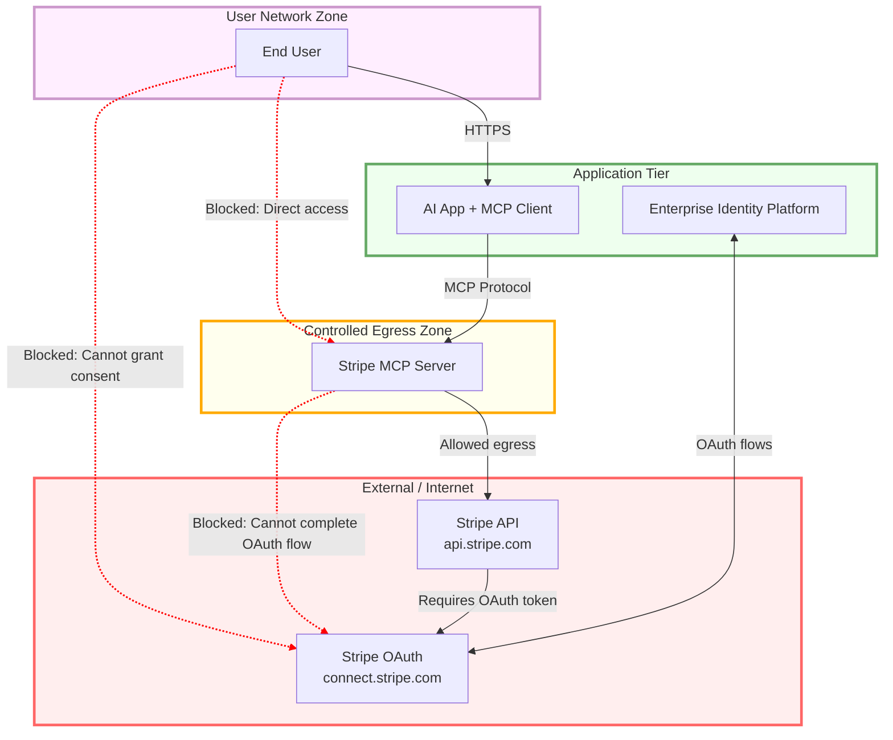

# MCP's Identity Crisis: When Security Theatre Meets Enterprise Reality

The Model Context Protocol (MCP) promises to be the "USB-C" of LLM integrations; simple, universal, and "extremely easy to build." Yet a fundamental disconnect exists between its security guidance and how authentication works in production systems. This isn't just a theoretical concern; it's creating an ecosystem where even official implementations can't follow the stated best practices.

<!-- more -->

## The Architectural Context

MCP positions itself as a lightweight protocol for connecting LLMs to external systems. The stated design principles emphasise:

- **"Extremely easy to build"** - Developers should focus on their core product
- **"Simple interfaces"** with "minimal implementation overhead"
- **Universal connectivity** - The USB-C analogy

These are excellent principles. The protocol itself elegantly achieves them, except when it comes to authentication.

## The Current State: A Tale of Two Patterns

The MCP specification (version 2025-06-18) provides no standard mechanism for upstream authentication. This silence, combined with security guidance that explicitly forbids token passthrough, has created a predictable outcome.

### What's Actually Happening in Production

Let's examine the official MCP implementations:

**Grafana's MCP Server:**

```json
{
  "env": {
    "GRAFANA_SERVICE_ACCOUNT_TOKEN": "<your service account token>"
  }
}
```

**GitHub's MCP Server:**

```json
{
  "env": {
    "GITHUB_PERSONAL_ACCESS_TOKEN": "${input:github_token}"
  }
}
```

**Stripe's MCP Server:**

```bash
npx @stripe/mcp --api-key=YOUR_STRIPE_SECRET_KEY
```

Each injects credentials at instance startup, creating a 1:1 binding between process and identity. This pattern, whilst simple to implement; fundamentally prevents multi-tenancy and contradicts modern cloud-native principles.

### Why This Pattern Dominates

These teams aren't taking shortcuts. They're responding rationally to constraints:

1. **No standard exists** for propagating user identity to upstream services
2. **Token passthrough is explicitly forbidden** in security guidance
3. **The emerging alternative** requires implementing OAuth in every server

The result? Everyone defaults to the simplest working solution: static credentials per instance.

## The Enterprise Authentication Landscape

To understand why this matters, let's examine how authentication actually works in enterprise environments:

<figure markdown="span">



<figcaption><span style="white-space: pre-wrap;">Enterprise network architecture showing OAuth authentication barriers in MCP deployments.</span></figcaption>
</figure>

Key characteristics:

- **Centralised token acquisition**: One system handles OAuth complexity
- **Token propagation**: Internal services receive pre-acquired tokens
- **Network isolation**: Internal services AND users often can't reach external OAuth providers
- **Audit trails**: Maintained at both identity and service layers

This isn't exotic; it's how AWS IAM, Google Cloud IAP, Azure AD, and virtually every enterprise identity system works.

## The Emerging Direction: URL Mode Elicitation

Recent developments ([PR #887](https://github.com/modelcontextprotocol/modelcontextprotocol/pull/887), merged into 'draft' spec) introduce URL mode elicitation as a proposed approach:

```typescript
// Server rejects caller's token and returns:
{
  elicitationId: "abc123",
  loginUrl: "https://provider.com/oauth/authorize"
}
// Server must then handle OAuth redirect...
```

Whilst this could work for interactive, browser-based scenarios where you have control and network access, it presents significant challenges:

### The Non-Interactive Problem

Many MCP use cases are autonomous:

- CI/CD pipelines triggering on commits
- Scheduled data synchronisation jobs
- Background analysis tasks
- Agent-to-agent communication

None of these can "open a browser" for authentication.

### The Network Topology Challenge

Enterprise networks typically isolate both internal services and users:

```yaml
internal_environment:
  services:
    internet_access: false  # Security requirement
    oauth_endpoints: blocked
  users:
    external_sites: restricted  # Often blocked by policy
    approved_domains: limited
```

Requiring OAuth flows at the MCP server level breaks this model.

### The Complexity Multiplication

If this pattern becomes standard, every MCP server would need to:

- Implement OAuth client logic
- Manage HTTPS endpoints for callbacks
- Handle state correlation and PKCE
- Implement token refresh logic
- Ensure security compliance (CSRF protection, secure storage)
- Meet regulatory requirements (data residency, audit logging)

This isn't just about OAuth; it's about each server becoming responsible for security, storage, compliance, and identity management. The "extremely easy to build" principle becomes "implement a complete identity system in every server."

## The Pattern of Dismissal

This isn't the first time these concerns have been raised. The GitHub discussions are littered with proposals that identified and tried to solve this exact problem:

* **Discussion [#193](https://github.com/modelcontextprotocol/modelcontextprotocol/discussions/193)** proposed multi-tenant client support, noting the inefficiency of spinning up separate processes per user. The response? *"Create unique instances of MCP servers."* 

* **Discussion [#234](https://github.com/modelcontextprotocol/modelcontextprotocol/discussions/234)** (by @wdawson) proposed exactly what enterprises need: passing user tokens at the tool level to enable multi-user scenarios. It was closed after URL mode was merged, despite URL mode not addressing the core concerns.

* **Issue [#195](https://github.com/modelcontextprotocol/modelcontextprotocol/issues/)** suggested using standard WWW-Authenticate headers and allowing clients to pass tokens directly. Sixteen developers agreed. No action taken.

* **Discussion [#804](https://github.com/modelcontextprotocol/modelcontextprotocol/discussions/804)** proposed a gateway-based model that would work with enterprise architectures. Still under discussion, likely to be superseded by URL mode.

Even a collaborator (@pwwpche) acknowledged the reality: 

> "An OAuth based MCP Server is a bit too heavy... enterprises would find it hard to implement an extra OAuth layer."

The community has repeatedly identified the problem. The solutions have been proposed. But the dogmatic rejection of token passthrough means they can't be considered.

## Examining the Security Rationale

The MCP security guidance presents concerns about token handling. However, there's a disconnect between identified risks and proposed solutions.

### The Validated Passthrough Pattern

Consider how API gateways, service meshes, and identity-aware proxies work:

```python
def handle_request(request, token):
    # Validate token properties
    claims = validate_token(token, 
        expected_issuer="corp.identity.provider",
        expected_audience="upstream.api",
        check_expiry=True
    )
    
    # Forward validated token to upstream
    upstream_response = call_upstream_api(
        request=request,
        auth_header=f"Bearer {token}"
    )
    
    return upstream_response
```

This pattern, validated passthrough; is industry standard. It appears in:

- AWS API Gateway
- Google Cloud Endpoints
- Azure API Management
- Kong, Traefik, Envoy
- Every major service mesh

The security comes from **validation**, not from preventing passthrough.

### Trust Boundaries and Reality

The current guidance suggests MCP servers can't be trusted with tokens, yet consider the trust already placed in the system: 

**MCP Clients** (typically part of the AI application's infrastructure): 

* Handle all user prompts before forwarding
* Orchestrate tool calls with sensitive parameters - Receive and process all responses 
* Are trusted as part of the host application's security boundary 

**MCP Servers**:

* Process those same prompts via tool calls
* Execute operations with user data
* Return results containing confidential information 

Both clients and servers must be equally trusted with data. If we trust them with user information, why not with scoped, time-limited tokens meant for upstream APIs?

## A Pragmatic Path Forward

Rather than forcing every MCP server to become an OAuth client, consider standardising identity propagation:

### The Conceptual Approach

The solution involves adding an optional `upstream_identity` field to MCP requests:

```typescript
export interface UpstreamIdentityPayload {
  type: string;        // "bearer", "basic", etc. (RFC 7235)
  token: string;       // The actual credential
  [key: string]: unknown;  // Extensible for additional context
}

export interface RequestParams {
  // Existing fields...
  
  /**
   * Optional, per-request credentials for upstream APIs.
   * This field provides a standard mechanism for Identity Propagation.
   * The server simply validates and forwards to the upstream API.
   */
  upstream_identity?: UpstreamIdentityPayload;
}
```

This approach:

- **Preserves simplicity**: Servers just validate and forward
- **Enables multi-tenancy**: One instance, multiple users
- **Aligns with enterprise patterns**: Tokens from central identity
- **Supports all environments**: Works without browsers or internet
- **Maintains security**: Full validation without OAuth complexity

*(A [detailed technical proposal](https://github.com/modelcontextprotocol/modelcontextprotocol/discussions/1827) explores the complete specification, including session-level patterns and implementation guidance.)*

## The Broader Pattern

This situation reflects a recurring challenge in protocol design: the tension between theoretical purity and operational reality.

MCP's core protocol succeeds because it embraces simplicity. The authentication challenges arise where that principle gives way to prescriptive security guidance that doesn't align with how systems actually work.

When official implementations unanimously diverge from stated best practices, it suggests the practices—not the implementations—need reconsideration.

## Moving Forward

MCP has tremendous potential to standardise LLM-to-system integration. The protocol foundation is solid. The tools system is well-designed. But authentication needs pragmatic solutions that acknowledge:

1. **Enterprise networks** have established patterns for identity propagation
2. **Multi-tenancy** requires identity at the request level, not instance level
3. **Simplicity** means not reimplementing OAuth in every server
4. **Security** comes from proper validation, not architectural constraints

## A Question Worth Answering

If MCP servers are trusted with user data but not with bearer tokens, what threat model justifies this distinction?

And if the answer is "defence in depth"—shouldn't we apply that principle by enabling secure patterns that people will actually use, rather than forcing complex ones they'll work around?

------

*The author is a Staff Engineer at Mozilla.ai, creator of [mcpd](https://github.com/mozilla-ai/mcpd), with extensive experience in enterprise authentication systems including work at HashiCorp on Vault and major financial institutions. This analysis is based on public specifications, official implementations, and established industry patterns.*