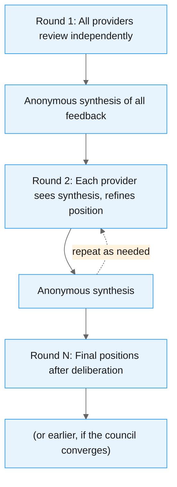
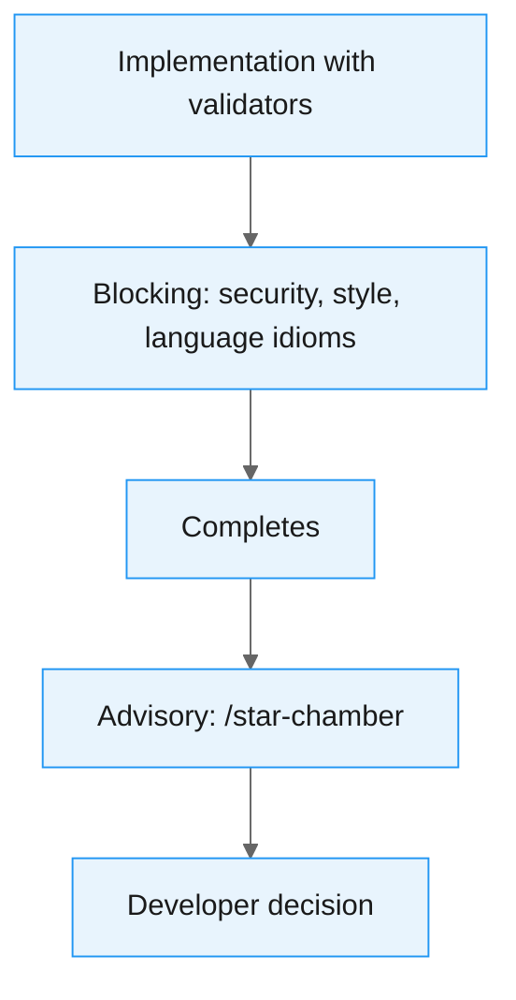

# The Star Chamber: Multi-LLM Consensus for Code Quality

Every AI model has blind spots. It might overlook context, lean toward certain patterns, or fill gaps with confident guesses. When you're using an AI coding agent to help with architecture decisions or code review, you're getting one perspective from one model. That's fine for straightforward work. But for decisions that shape the long-term direction of a codebase, one perspective isn't enough.

The Star Chamber is a [skill](https://docs.anthropic.com/en/docs/claude-code/skills) for [Claude Code](https://docs.anthropic.com/en/docs/claude-code/overview) that fans out code reviews and design questions to multiple LLM providers simultaneously, aggregates their feedback, and presents consensus-based recommendations. Think of it as a senior engineering council that reviews the same code independently, then you get a summary of where they agree and where they don't.

<!-- more -->

The name is a nod to [Mark Schwartz's](https://www.linkedin.com/in/innovativecio/) [A Seat at the Table](https://itrevolution.com/product/a-seat-at-the-table/), where he talks about the "Star Chamber" when describing the governance review board that oversees IT decisions. Schwartz argues that these boards should focus on outcomes and confidence rather than wading through planning documents or ceremony that were never really what they needed. It has stuck with me for years, and so the Star Chamber here is the same idea applied to code: A panel that gives you confidence in decisions through a structured, multi-perspective review. His books are definitely worth checking out, particularly [A Seat at the Table](https://itrevolution.com/product/a-seat-at-the-table/) and [The (Delicate) Art of Bureaucracy](https://itrevolution.com/product/the-delicate-art-of-bureaucracy/).

The original [Star Chamber](https://en.wikipedia.org/wiki/Star_Chamber) was a 15th-17th century English court at the Palace of Westminster, a council of privy councillors and common-law judges established to handle cases too significant for ordinary courts. A panel of independent reviewers, each bringing different expertise, deliberating on the same evidence.

The Star Chamber is part of a broader project called [agent-pragma](https://github.com/peteski22/agent-pragma), which I'll come back to shortly.

## The Problem with Single-Model Review

If you've worked with AI coding agents, or even indulged in browser-based LLM chats for coding questions, you'll recognise this pattern:

1. Ask Claude a question, get an answer
2. Your experience tells you something else, so open ChatGPT and pit it against Claude's response
3. Take that answer, paste it into Gemini to play devil's advocate one more time
4. Mentally synthesise the results, weigh them up, decide what to do
5. Repeat next time you have a question

It works, but attrition is the killer. After a few rounds of copy-pasting between tabs, "good enough" starts to feel like a reasonable answer and the rigour quietly drops off.

And each model notices different things, or has a style of writing code, or uses a particular version of a language it was trained heavily on. Claude might catch architectural concerns but miss performance implications. GPT might flag security issues but overlook idiomatic patterns. Gemini might spot documentation gaps but be less opinionated about error handling.

None of them are wrong. They're just different. And in a real engineering team, you'd want multiple reviewers precisely because different people notice different things.

In a remote-first world, there's also a practical angle. You don't always want to interrupt a colleague to rubber duck a design question or get a second opinion on an approach. That kind of collaboration is valuable and I'd never want to replace it, but something like the Star Chamber can handle the low-hanging fruit: the quick sanity checks, the "am I overthinking this?" moments. It means when you do pull someone in for a pairing session or a deeper discussion, you're bringing a sharper, better-tested starting point.

So the question became: what if that whole process of consulting multiple models and synthesising their views could be automated in a constructive way?

## `agent-pragma`: The Bigger Picture

Before diving into the Star Chamber, it's worth understanding the project it belongs to...

[agent-pragma](https://github.com/peteski22/agent-pragma) is a collection of skills, agents, and validators for Claude Code that aim to make working with Claude more deterministic.

The core problem: Claude Code's rules (defined in `CLAUDE.md` files) are followed inconsistently. You can tell Claude to follow the [Go Proverbs](https://go-proverbs.github.io/), or to always validate security boundaries, or to use a specific error handling pattern, but there's no guarantee it will remember or apply those rules on every implementation. `agent-pragma` solves this by mechanically injecting rules and validating compliance using semantic validators that run automatically.

It includes:

- **Validators** that block implementation until issues are resolved (security, Python style, Go idioms, TypeScript conventions)
- **`/setup-project` skill** that bootstraps everything: project rules, validator configuration, and the one-time Star Chamber provider setup
- **`/implement` skill** that wraps implementation with automatic validation
- **`/star-chamber` skill** for advisory multi-LLM review

The validators distinguish between **musts** and **shoulds**. Musts are non-negotiable: if a validator flags a must, it has to be fixed before implementation can proceed. Shoulds are different: Claude can choose to skip a should, but only if it provides a rationale for why. This stops rules being blindly applied in cases where they genuinely don't fit, while still requiring the decision to be conscious and documented.

When you run `/implement`, you get a summary at the end showing everything: which validators ran, what was flagged, what was fixed, and any shoulds that were skipped with their rationale. It gives you a single place to review the decisions that were made on your behalf.

The Star Chamber sits alongside all of this as the advisory part: subjective, contextual, and ultimately the developer's call.

## How the Star Chamber Works

The Star Chamber operates as both a skill (invoked explicitly with `/star-chamber`) and an [agent](https://docs.anthropic.com/en/docs/claude-code/sub-agents) (auto-invoked when Claude Code encounters significant design decisions). When triggered, it follows a straightforward process:

**1. Gather context.** It collects the code to review (from explicit file arguments, local changes, staged changes, or recent commits), reads any project rules from `CLAUDE.md` and `ARCHITECTURE.md`, and builds a structured review prompt.

**2. Fan out to providers.** The prompt goes to all configured LLM providers in parallel. Out of the box, this means Claude, GPT, and Gemini, but the provider list is configurable. Each model reviews the code independently, with no knowledge of what the others are saying.

**3. Aggregate by agreement.** Results come back and get classified:

- **Consensus issues** (all providers flagged it) - highest confidence, address first
- **Majority issues** (two or more providers) - high confidence, worth investigating
- **Individual observations** (one provider only) - may be a specialised insight, or may be noise

This classification is the key value. When three different models independently flag the same concern, you can be reasonably confident it's a real issue. When only one model raises something, it's still worth reading, but you calibrate your confidence accordingly.

What makes this aggregation work reliably is that each provider returns structured JSON against a defined contract, not free-text prose. Issues have typed fields: severity (`high`, `medium`, `low`), location (`file:line`), category (`craftsmanship`, `architecture`, `correctness`, `maintainability`), a description, and a suggested fix. This structure means the aggregation can group issues by location and category to determine genuine consensus rather than relying on fuzzy text matching.

## Two Modes: Parallel and Debate

The default mode is **parallel**: all providers review independently in a single round. It's fast and good enough for most reviews.

For questions where you want the models to engage with each other's reasoning, there's **debate mode** (`--debate`). You can specify the number of rounds with `--rounds N`:

```console
/star-chamber --debate --rounds 3
```

After each round, an anonymous summary of all providers' feedback is shared back to every provider for the next round. The crucial detail here is that it follows the [Chatham House rule](https://www.chathamhouse.org/about-us/chatham-house-rule). Providers see what was said but not who said it.

<figure markdown="span">



<figcaption>Debate mode: providers review independently each round, with anonymous synthesis shared between rounds.</figcaption>
</figure>

I believe the anonymity matters. Attribution might anchor the discussion - if a model knows "Claude said X", that becomes a reference point to agree or disagree with rather than an idea to engage with on its merits. By stripping the source, the synthesis is just a set of observations and arguments. The models don't need to know whether feedback came from another LLM or a human; what matters is the substance.

A debate round might share something like:

> **Other council members' feedback (round 1):**
>
> **Issues raised:**
>
> - The config loader silently ignores missing env vars, risking runtime errors
> - Linear search in `get_resource_definition` may be slow for large configs
> - Consider adding a strict mode for env var validation
>
> **Points of agreement:**
>
> - Type hints are solid
> - Overall code structure is clean
>
> Please provide your perspective on these points.

Each provider then re-evaluates, sometimes changing position when presented with arguments they hadn't considered, sometimes doubling down with additional evidence. The process can converge before reaching the specified number of rounds if the providers reach agreement early. The result is a more thorough analysis than any single round could produce.

## An Example: The Star Chamber Reviews Itself

Early on, I pointed the Star Chamber at itself - a meta-review of its own code in debate mode with GPT-4o, Claude, and Gemini ([full output](https://github.com/peteski22/agent-pragma/issues/2)):

**Consensus Issues (All Providers Agree)**

| # | Location | Severity | Category | Description |
|---|----------|----------|----------|-------------|
| 1 | `llm_council.py:debate_mode` | MEDIUM | correctness | Debate mode lacks mechanism to prevent infinite loops if LLMs disagree. No convergence detection. |
| 2 | `llm_council.py:API_key_handling` | MEDIUM | security | API keys loaded without proper masking in logs/error messages. Risk of accidental exposure. |
| 3 | `llm_council.py:various` | MEDIUM | architecture | Code lacks clear separation of concerns - SDK loading, provider interaction, review logic, and aggregation all in one file. |

**Majority Issues (2/3 Providers)**

| # | Location | Severity | Category | Description |
|---|----------|----------|----------|-------------|
| 1 | `llm_council.py:get_provider_client` | HIGH | correctness/security | Dynamic SDK loading via importlib doesn't validate imported module. Risk of loading malicious packages. |
| 2 | `llm_council.py:run_parallel_reviews` | MEDIUM | correctness | No timeout mechanism for parallel reviews. Hanging LLM call could block indefinitely. |

All of those were legitimate findings. The convergence detection issue, the API key masking, the timeout handling - these were real problems that got fixed. The fact that the tool found genuine issues in its own implementation was a good early signal that the approach works. Turtles all the way down.

## Design Questions, Not Just Code Review

The Star Chamber isn't limited to reviewing code that already exists. It handles design and architectural questions too. If you're deciding between event sourcing and traditional CRUD for an audit trail, or weighing whether to introduce a message queue versus synchronous processing, you can put the question to the council.

You can mix code review with design goals in a single invocation:

```console
/star-chamber --debate --rounds 3 review local changes for design and achieving the goal of GitHub issue #42
```

Each provider evaluates the local changes against both the code quality and the intent of the issue, then refines through debate. You get a structured analysis of where three different models converge and where they see legitimate trade-offs.

## Where This Fits in the Pipeline

The Star Chamber is explicitly **advisory, not blocking**. In agent-pragma, semantic validators run automatically and block implementation until issues are resolved. The Star Chamber sits after that:

<figure markdown="span">



<figcaption>Validators block until fixed. The Star Chamber advises, but the developer decides.</figcaption>
</figure>

Validators enforce objective, automatable rules: "don't use `assert` for control flow", "error strings shouldn't be capitalised", "never commit secrets." These are binary.

The Star Chamber handles subjective, contextual questions: "is this the right abstraction?", "will this scale?", "is this over-engineered?" Those need human judgement as the final arbiter.

When running as an agent (auto-invoked), it uses parallel mode only and limits itself to genuinely significant decisions. It won't fire on a README change or a routine bug fix.

## The Plumbing

Under the hood, the Star Chamber uses Mozilla.ai's open source [any-llm](https://github.com/mozilla-ai/any-llm) to talk to providers, executed via `uv run` so there's no global Python installation to manage.

Provider configuration lives in `~/.config/star-chamber/providers.json` and gets set up the first time you run `/setup-project`.

A multi-LLM system means managing API keys for every provider you want to use. That gets old fast. Three providers means three API keys in environment variables, three billing dashboards, three sets of usage limits to track. The [any-llm managed platform](https://any-llm.ai/) (built at Mozilla.ai, in [open beta](https://blog.mozilla.ai/secure-your-keys-track-your-costs-any-llm-managed-platform-enters-open-beta/) at the time of writing) solves this with a single virtual key. You store one `ANY_LLM_KEY` environment variable and it handles authentication to all configured providers. Your actual provider keys are encrypted client-side and never stored in raw text on their servers.

With platform mode, the provider config is clean:

```json
{
  "platform": "any-llm",
  "providers": [
    {"provider": "openai", "model": "gpt-5.2"},
    {"provider": "anthropic", "model": "claude-opus-4-6"},
    {"provider": "gemini", "model": "gemini-2.5-flash"}
  ],
  "consensus_threshold": 2,
  "timeout_seconds": 60
}
```

You also get usage tracking, cost analytics, and budget controls across all providers in one place, which is particularly useful for something like the Star Chamber where every invocation fans out to multiple models. No prompt content is logged, only metadata like token counts, cost, and latency.

Alternatively, you can use individual API keys per provider if you prefer direct access. Either way, adding or removing providers is just a config change. You can easily configure Mistral or Llama with just an additional `providers.json` entry and the SDK handles the rest.

## Validation: Perplexity's Model Council

About a week after the first Star Chamber commits landed (January 30th), Perplexity [launched Model Council](https://www.perplexity.ai/hub/blog/introducing-model-council) on February 5th, a feature that runs queries across multiple frontier models simultaneously and synthesises the results. Neither project influenced the other; we just arrived at the same idea independently. Their framing mirrors the same intuition:

> Every AI model has blind spots. It might overlook context, lean toward certain perspectives, or fill gaps with confident guesses. For research you're acting on, it's a big risk.

Their approach sounds very similar to ideas in agent-pragma, running the query through Claude, GPT, and Gemini in parallel, then a synthesizer model resolves conflicts and shows where the models agree versus diverge.

When two teams working on completely different problems independently converge on a similar solution or architecture, that's a strong signal that multi-model consensus is becoming a recognised pattern for any task where accuracy matters more than speed.

Although the projects have different domains and scopes: Perplexity for research queries and Star Chamber for software engineering (code review, catching bugs, and design trade-offs), it's the same principle.

## Why This Works

It's the same reason code review works in human teams. No single reviewer catches everything, but different people bring different knowledge, different pattern recognition, and different things they're sensitive to. The Star Chamber just applies that to AI-assisted development, using models with different training data and architectures instead of people with different backgrounds and experience.

## What I've Learned Using It

A few observations from building and using this:

**Consensus issues are almost always worth fixing.** When three independently-trained models flag the same concern, ignoring it is hard to justify. These tend to be genuine problems, not stylistic preferences.

**Individual observations are where the interesting insights hide.** Sometimes only one model spots something, and it turns out to be the most valuable feedback. The classification doesn't mean "ignore individual observations"; it's more like "calibrate your confidence accordingly."

**Debate mode changes minds.** In multi-round debates, providers regularly shift position after seeing anonymous synthesis. And yes, LLMs are generally sycophantic, but in this case the anonymous synthesis seems to genuinely surface arguments they hadn't considered rather than just agreeing for the sake of it. This is the strongest argument for debate over simple parallel review.

**The advisory-not-blocking distinction is essential.** Making it blocking would slow development to a crawl and create false authority. These are AI opinions informed by multiple perspectives, but still opinions. The engineer decides.

## What's Next

There's one direction I'm particularly interested in: assigning personas to council members. Rather than three generic reviewers, you'd configure the council so one member reviews through a security lens, another focuses on performance, and a third evaluates maintainability. Different lenses on the same code, reflecting how a well-structured review team would actually operate.

The original idea for the Star Chamber was actually a Slack-based chat room where different AI models could discuss your code in a thread. Building it as a Claude Code skill turned out to be more practical, but the conversational quality of debate mode captures some of that original spirit.

## Update: March 2026

A few things have moved since this post went up.

**The rename.** `claude-pragma` is now [agent-pragma](https://github.com/peteski22/agent-pragma). The original name tied it to Claude Code, but it now works with [OpenCode](https://opencode.ai) too, so the broader name fits better. I've updated the references in this post to match.

**Star Chamber is now a standalone SDK.** This is the biggest change. What started as a Python script embedded inside the plugin — council logic, provider transport, consensus classification, prompt templates, all in one place — has been extracted into its own [repository](https://github.com/peteski22/star-chamber) and published to PyPI. You can use it independently of agent-pragma as a CLI (`uvx star-chamber review ...`) or as a Python library (`from star_chamber import run_council`). About 3,000 lines moved out of agent-pragma in the process.

The extraction also produced a formal [council protocol specification](https://github.com/peteski22/star-chamber) with JSON schemas defining the wire format between the orchestrator and providers. What was implicit in the original implementation is now an explicit, versioned contract. The skill inside agent-pragma is now a thin wrapper that shells out to the SDK.

**Dual-entrypoint architecture.** The Star Chamber now operates as both an explicit skill (`/star-chamber`) and an auto-invoked agent that fires on significant architectural decisions. The agent uses a lighter-weight model and parallel mode only, keeping it fast enough to run in the background without disrupting flow. When it triggers as an agent, you get the council's take without having to remember to ask for it.

**Zero-config.** Skills now work immediately without running `/setup-project` first. The setup skill still exists for customising validator configuration and provider lists, but it's no longer a prerequisite. You install the plugin and go.

## Try It

The Star Chamber can be used standalone or as part of agent-pragma.

**Standalone SDK** (no plugin required):

```console
uvx star-chamber review src/main.py src/config.py
uvx star-chamber ask "Should this service use event sourcing or CRUD?"
```

Both `review` and `ask` support the same set of flags:

| Flag | Description |
|------|-------------|
| `-p` / `--provider` | Provider to include, repeatable (e.g. `-p openai -p anthropic`) |
| `--context-file` | File containing project context to include in the prompt |
| `--council-context` | Prior council round feedback for debate mode |
| `--config` | Path to a `providers.json` |
| `--timeout` | Per-provider timeout in seconds |
| `--format` | Output format: `text` (default) or `json` |
| `--output` | Write JSON result to a file |

The `--context-file` flag is particularly useful for feeding in an `ARCHITECTURE.md` or `CLAUDE.md` so the council reviews against your project's actual conventions rather than general best practice.

**With the any-llm managed platform:**

If you're using the [any-llm managed platform](https://any-llm.ai/) for centralised key management (one virtual key instead of one per provider), install with the platform extra:

```console
uvx --with 'star-chamber[platform]' star-chamber review src/main.py
uvx --with 'star-chamber[platform]' star-chamber ask "Event sourcing or CRUD for the audit trail?"
```

Your `providers.json` stays the same as described in the [Plumbing](#the-plumbing) section above — the extra just pulls in the platform client that resolves your `ANY_LLM_KEY` against the configured providers.

**As part of agent-pragma** (includes validators, `/implement`, and auto-invocation):

```console
/plugin marketplace add peteski22/agent-pragma
/plugin install pragma@agent-pragma
```

Then `/star-chamber` whenever you want a council review. If you want to customise provider lists or validator configuration, `/setup-project` handles that, but it's optional.

I'm particularly interested in how other people configure their provider lists and whether different model combinations surface different kinds of insights. If you try it, I'd like to hear what you find.
